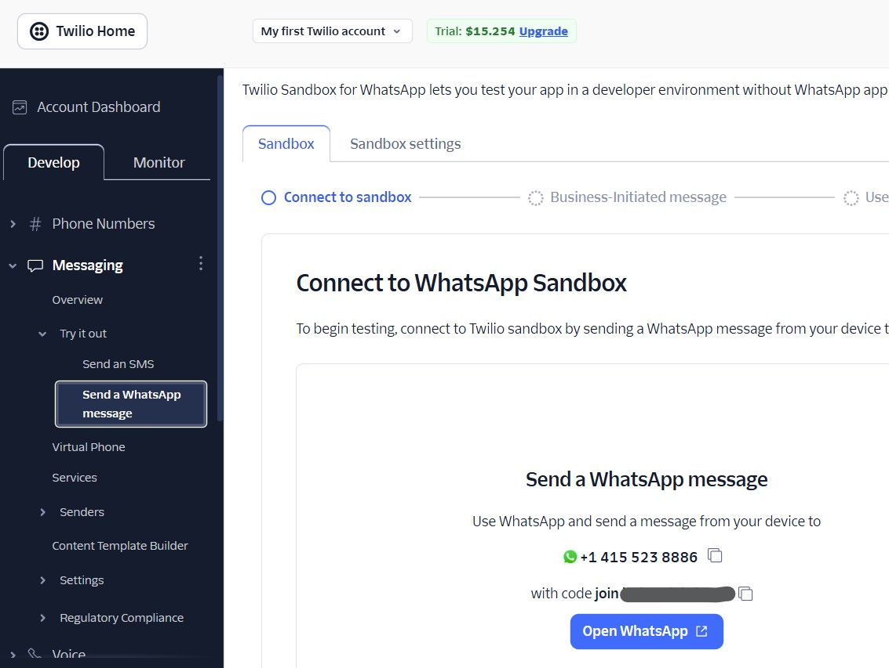
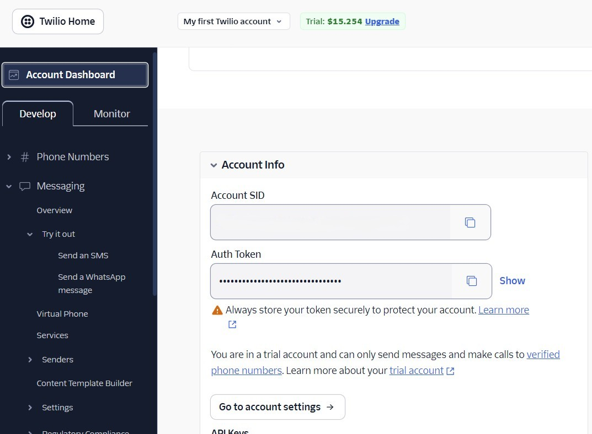
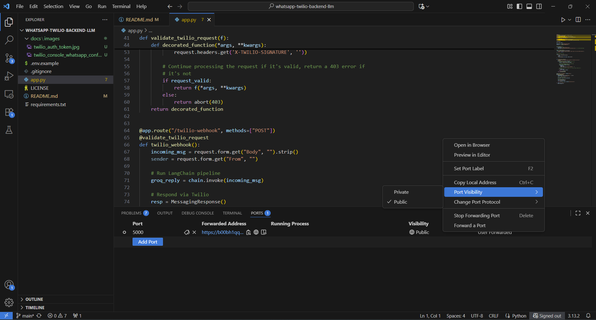
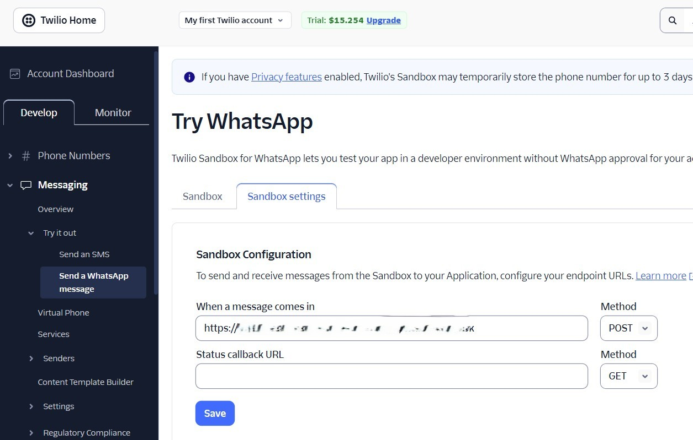

# Minimalist Whatsapp LLM Chatbot 
Simple Implementation of Whatsapp based LLM chatbot - Whatspp <-> Twilio <-> Python Backend <-> LLM

# Installation Steps

## Step 1: Create Account on Twilio Console
- Sign up or log in to the Twilio Console.
## Step 2: Join Twilio Sandbox
- Twilio provides sandbox with preconfigured number (we don't need to configure our whatsapp business number). Any whatsapp number can join this sandbox by sending the 'join <xxx>' message as shown in the below image

## Step 3: Get the Twilio Auth Token
- Obtain your **Auth Token**. This is required to validate twilio request to webhook URL. Twilio Auth token can be obtained from 'Account Dashboard' as shown in the below image


## Step 4: Get Groq API Key
- Register or log in to Groq.
- Obtain your **API Key**.

## Step 5: Configure Port Forwarding in Visual Studio Code for Port 5000
- Go to the **PORTS** tab in VS Code.
- Set up port forwarding for port `5000`. Make sure visibility is set to 'public'. This will create public port forwarding address, this is required to configure webhook URL in Twilio
- **Copy the Webhook URL** shown in the PORTS tab.


## Step 6: Configure webhook URL
- Copy the 'forwarded address' obtained from the previous step and configure webhook URL in Twilio console (Sandbox settings-'when messages comes in') as shown in the below image


## Step 7: Installation & Configuration

1. **Create a virtual environment:**
```
python3 -m venv venv
```
2. **Activate the virtual environment:**
- On Linux/macOS:
  ```
  source venv/bin/activate
  ```
- On Windows:
  ```
  venv\Scripts\activate
  ```
3. **Install dependencies:**
```
pip install -r requirements.txt
```
4. **Set up environment variables:**
- Copy `.env.example` to `.env`
- Update `.env` with your **Twilio Auth Token**, **Groq API key**, and **Webhook URL**

## Step 8: Run the Application
```
python app.py
```
## Step 9: Usage
- Now we should be able to send messages to twilio sandbox and interact with LLM

NOTE: Max message length allowed is 1600 chars. We need to send multiple message in case we want bigger response. Prompt needs to be updated accordingly. 